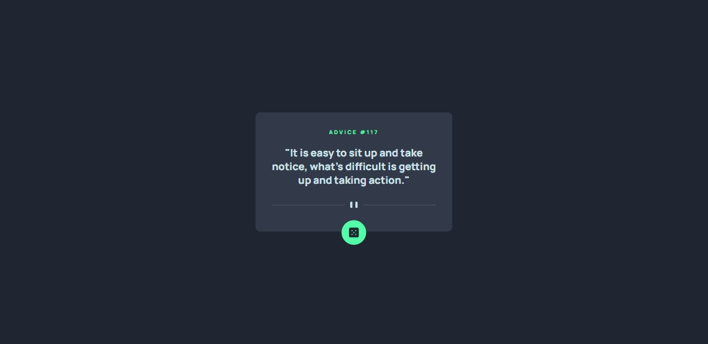

# Frontend Mentor - Advice generator app solution

This is a solution to the [Advice generator app challenge on Frontend Mentor](https://www.frontendmentor.io/challenges/advice-generator-app-QdUG-13db). Frontend Mentor challenges help you improve your coding skills by building realistic projects.

## Table of contents

- [Overview](#overview)
  - [The challenge](#the-challenge)
  - [Screenshot](#screenshot)
  - [Links](#links)
- [My process](#my-process)
  - [Built with](#built-with)
  - [Continued development](#continued-development)
- [Author](#author)

**Note: Delete this note and update the table of contents based on what sections you keep.**

## Overview

### The challenge

Users should be able to:

- View the optimal layout for the app depending on their device's screen size
- See hover states for all interactive elements on the page
- Generate a new piece of advice by clicking the dice icon

### Screenshot

### Links

- Solution URL: [Add solution URL here](https://github.com/Ashraf-Hessen/advice-generator-app)
- Live Site URL: [Add live site URL here](https://advice-generator-ra.netlify.app/)

## My process

### Built with

- HTML 5
- CSS custom properties
- Mobile-first workflow
- Javascript

### Continued development

I will add to project some effect that contains 3d effects and i think for add get advice optional id that let the user write number to get advice that has id equal this number.

## Author

- Frontend Mentor - [@Ashraf-Hessen](https://www.frontendmentor.io/profile/Ashraf-Hessen)
- Twitter - [@RadientAxis](https://www.twitter.com/RadientAxis)
